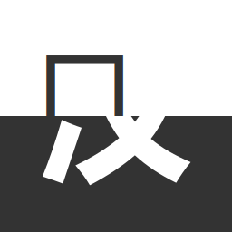

     
    
    <h1>中文汉字→日本漢字</h1>
    
一个专注于将中文汉字转换到日语中对应漢字的在线应用

     
     

__作为一名日语学习者，你是否常常遇到这样的困扰❓__

当你看到一个日语词汇时，想要查询它的读音，却因为部分和制汉字无法直接用中文输入法打出而无从下手？

__刚好，这就是你梦寐以求的解决方案❗__

[__中文汉字→日本漢字__](https://hanzi2kanji.zeabur.app/) 为正在学习日语的中文母语者量身定制，无需复杂操作，轻松查询目标和制汉字的读音、用法和例句。

## ⚡ 使用

在线地址：[https://hanzi2kanji.maozi.io/](https://hanzi2kanji.maozi.io/)

## ✨ 特点

- __完全免费__：无需注册，即开即用，让学习更高效
- __精准匹配__：内置丰富的中日汉字对照字库，准确度有保障
- __一键查询__：每个搜索结果都附带 Weblio、Jisho、KanjiPedia 等知名日语字典的快捷链接，轻松跳转查看详细释义与用法
- __开源免费__：字库数据和源代码完全公开，不追踪任何用户数据

## 🐛 反馈

你可以在 [Issues](https://github.com/BHznJNs/hanzi2kanji/issues) 或者[这个帖子](https://meta.appinn.net/t/topic/64334)下反馈你所遇到的任何问题。

## 🙏 鸣谢

本项目所使用数据来源如下：
- 中文汉字转和制汉字的数据：[Hanzi2Kanji](https://github.com/Huifusu/Hanzi2Kanji/blob/master/loadDictionary.js)
- 和制汉字的发音数据：[Kanji-Dojo-Data](https://github.com/syt0r/Kanji-Dojo-Data)
- 和制汉字的例句数据：
    - [jotoba.com](https://jotoba.com/api/search/sentences)
    - [tatoeba.org](https://tatoeba.org/en/api_v0)

在此感谢🙏！
